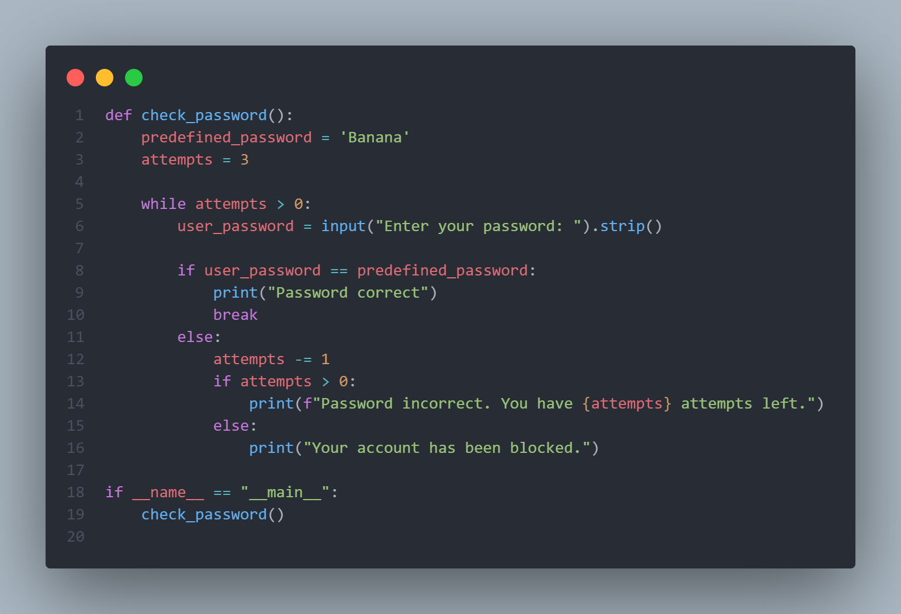
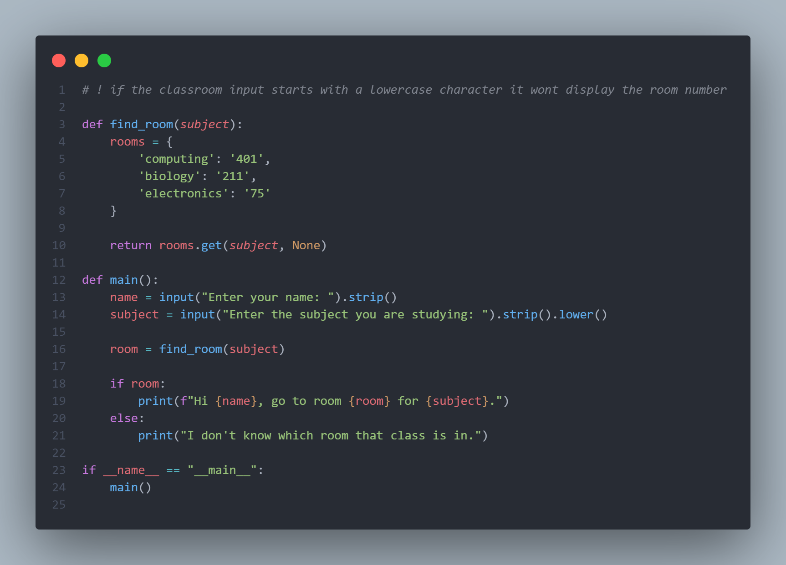
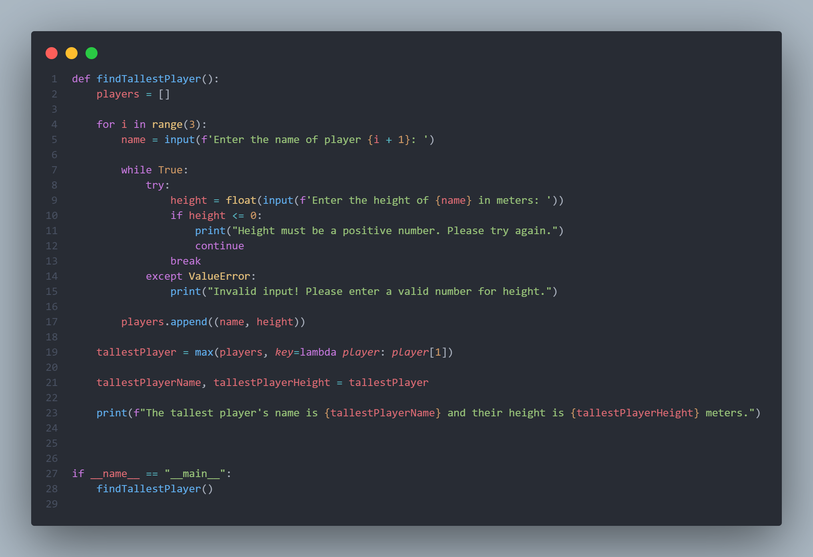
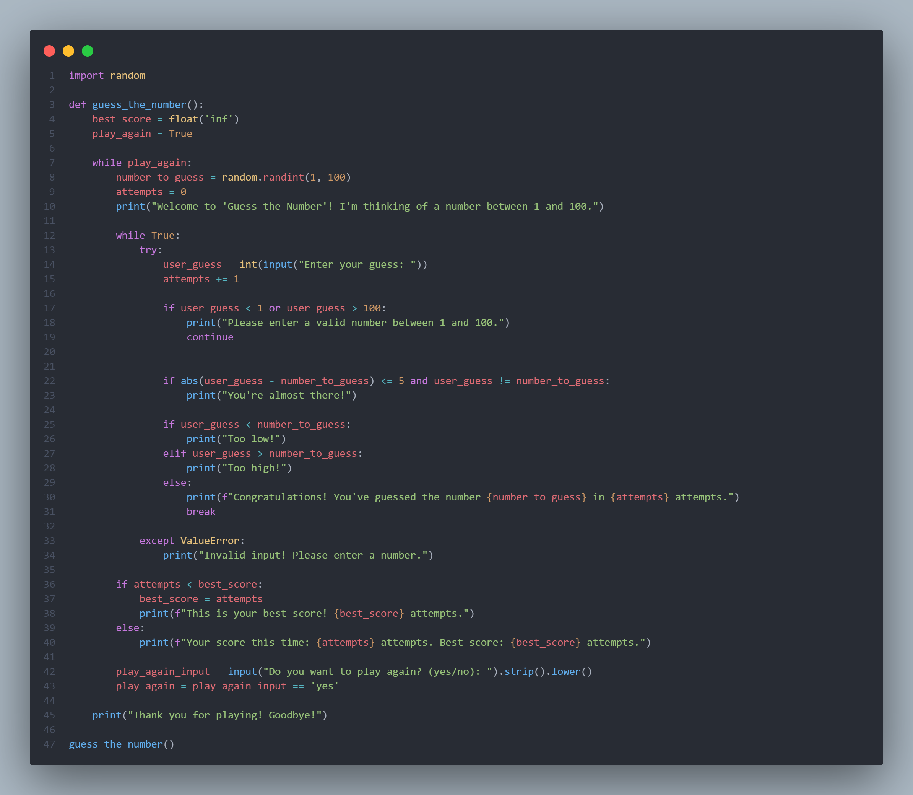

# Aleksandar Ivanov 5405785

**Personal Experience Portfolio – Week 2 in University**

---

**Day 1: Introduction to Static HTML**

The week kicked off with an introduction to **HTML**, where we explored how to create and display **static web content**. We learned the fundamental building blocks of a webpage, such as using **headings** (H1, H2, etc.) to structure content, **paragraphs** for text, and other elements like lists and links to add depth to a webpage. I particularly enjoyed the simplicity of HTML and how a few lines of code could produce a structured and readable web page in a browser. We also explored how different HTML tags interact with one another, and it was fascinating to see how these basic structures form the foundation of more complex websites.

During the session, I experimented with formatting text, organizing content with different headings, and playing around with paragraph alignment. Although this was just an introduction, it sparked my curiosity about web development and how HTML, in combination with other technologies, can be used to build dynamic, interactive sites. It was a strong start to the week, laying the groundwork for more advanced topics later in the course.

## Figma Prototype Link
  - [Balloon Pop game hangman based game ](https://www.figma.com/design/2EufmOP4LE7qMmvk8iLZlY/Balloon-popping?node-id=0-1&m=dev&t=YU7T9nV9wyq3CDWL-1)

## Hosted Ballon Game 
 - [Balloon Pop game website ](https://www.figma.com/design/2EufmOP4LE7qMmvk8iLZlY/Balloon-popping?node-id=0-1&m=dev&t=YU7T9nV9wyq3CDWL-1)

---

**Day 2: Advanced Flowchart Visualizations**

On the second day, we returned to **flowcharting** but took it to the next level by working on more **complex algorithm visualizations**. In this session, we focused on how to represent more advanced programming structures, like loops, nested conditionals, and decision-making processes within our flowcharts. The flowcharts became more detailed, as we now had to incorporate multiple decision points and feedback loops, making the logic more intricate.

This deeper exploration of flowcharts helped solidify my understanding of algorithm design. It gave me a clearer view of how to logically structure programs before diving into writing code. By using these visual tools, I was able to break down complex problems into smaller, more manageable steps. We worked on visualizing scenarios that required multiple outcomes and repetitive processes, which made me more confident in tackling larger coding challenges. Flowcharting has become one of my favorite tools to use before writing any piece of code as it makes the overall development process smoother.

## Flowcharts can be found in the gitlab respository but for some reason it doesnt let me open them in chart.io

---

**Day 3: Diving Deeper into Python – Strings and Functions**

The third day was all about going deeper into **Python**. We revisited what we had learned in the previous week, but this time we focused on more advanced **string manipulation** techniques and functions. The day was spent learning how to work with **strings**, which are a fundamental aspect of most programs, and understanding how to modify, format, and clean string data. 

We were introduced to key Python functions like **max()**, which allowed us to find the largest value in a list, and **strip()**, which was useful for cleaning up strings by removing extra spaces or specific characters from the beginning and end. We spent time coding various examples to see how these functions could be used in real-world applications, such as processing user input or analyzing text data. 

The hands-on coding exercises helped me grasp how powerful and flexible Python’s built-in functions can be. We also practiced slicing strings, finding substrings, and using loops to iterate over strings to manipulate text in different ways. The session was both challenging and rewarding, and it felt like a significant step forward in my Python journey. By the end of the day, I felt more confident in my ability to use Python for text processing tasks, and I’m excited to continue building on this knowledge.

## Python Exercises
- Check Password `(including flowchart)`
 - 
- Find classroom `(including flowchart)`
 - 
- Find tallest plater `(including flowchart)`
 - 
- Guess the number `(including flowchart)`
 - 

---

**Day 4: Group Research – The Future of Software Development**

Day four was focused on **group research**. In groups of 3-4, we were tasked with selecting a topic to explore, and my group chose **The Future of Software Development**. This research project was an opportunity to dive into current trends and speculate on the future of the industry. We split the research responsibilities within our group and explored various subtopics such as the rise of **artificial intelligence**, **machine learning**, **automation**, and **cloud computing**. 

One of the most interesting aspects of our research was looking into how **AI and automation** are predicted to change the software development process, potentially reducing the need for human coders in certain areas while enhancing creativity and productivity in others. We also explored how **low-code and no-code platforms** are growing in popularity, allowing people with little to no programming experience to build applications. 

After gathering our findings, we put together a short presentation to share with the rest of the class. Each group had the opportunity to present, and it was insightful to hear other groups’ perspectives on topics like cybersecurity, the evolution of programming languages, and ethical considerations in software development. The presentation went smoothly, and I felt our group had a strong grasp of the subject. 

---

**After-Class Discussion with the Teacher**

After the group presentation, I stayed behind to have a one-on-one discussion with the teacher. I wanted to seek clarification on a few things from the week’s lessons, especially regarding the **flowcharts** we had worked on earlier. I had some questions about how to represent more complicated logic structures visually, and my teacher provided some useful advice on how to refine my flowcharts and make them clearer and more efficient. We also discussed some of the advanced functions within **Fontys Canvas**, such as using the platform to organize group work and track assignment progress, which will be useful for managing my workload as the semester progresses.

---

**Day 5: University Day Off**

Day five was a university-wide day off, so I took the opportunity to review the materials from the week and catch up on personal tasks. I also used the time to dive deeper into Python string manipulation and practice creating flowcharts for complex problems, which helped reinforce what I had learned.

---

**Reflection**

Week 2 was packed with valuable learning experiences. From the introduction to **HTML** and exploring more advanced **flowcharting techniques** to delving deeper into **Python string functions** and working collaboratively on a **research project**, it was a well-rounded week of both technical and theoretical learning. The group research on **the future of software development** was particularly eye-opening, as it helped me understand the industry’s direction and how I might position myself within it. The after-class discussion with the teacher was also incredibly helpful, as it gave me practical advice on improving my work. 

Overall, this week built on the foundation set in Week 1, expanding my skills in coding, algorithm design, and teamwork, and leaving me eager for the challenges ahead.

## Everything can be found in my gitlap respository from the beggining of the semester to current date
[gitlab link](https://git.fhict.nl/I554344/university-work)